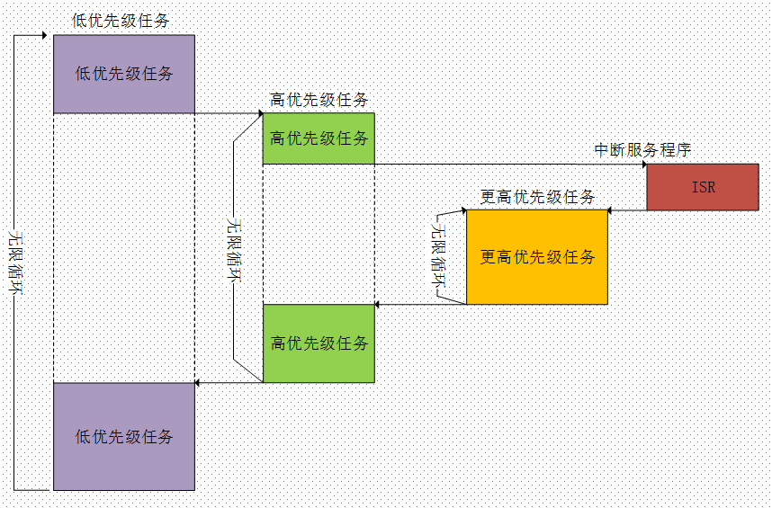

# 介绍
- RTOS全称为：Real Time OS，就是实时操作系统，强调的是：实时性。实时操作系统又分为硬实时和软实时。硬实时要求在规定的时间内必须完成操作 ，硬实时系统不允许超时，在软实时里面处理过程超时的后果就没有那么严格。 在实时操作系统中，我们可以把要实现的功能划分为多个任务，每个任务负责实现其中的一部分，每个任务都是一个很简单的程序，通常是一个死循环。 RTOS操作系统：FreeRTOS，UCOS，RTX，RT-Thread，DJYOS等。 RTOS操作系统的核心内容在于：实时内核。
# 内核
## 可剥夺型内核
- 可以剥夺其他任务的CPU使用权，它总是运行就绪任务中的优先级最高的那个任务。
